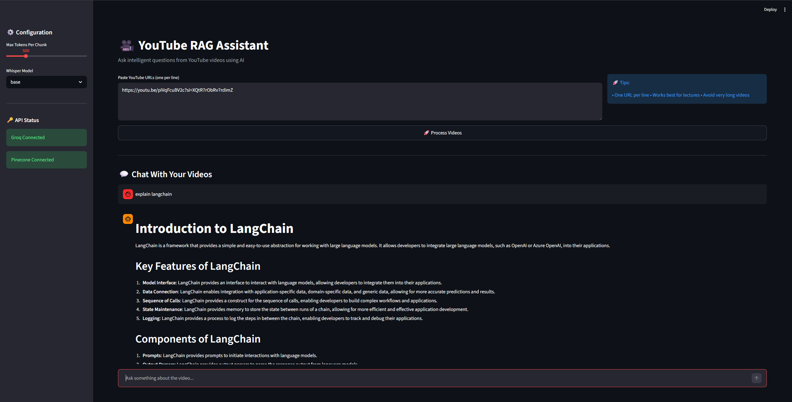
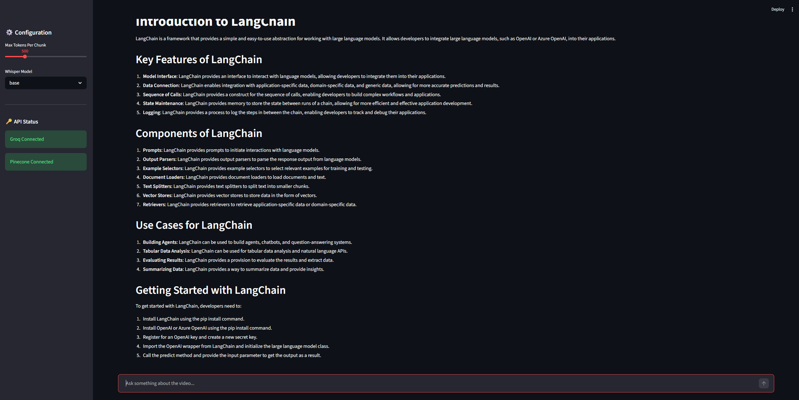

# 🎥 YouTube RAG Assistant  

Ask intelligent questions from YouTube videos using AI.

The **YouTube RAG Assistant** is an end-to-end Retrieval-Augmented Generation (RAG) system that enables users to ask context-aware questions about any YouTube video.  

The system automatically:
1. Downloads the video
2. Transcribes it using Whisper
3. Chunks the transcript intelligently
4. Generates embeddings
5. Stores them in a vector database
6. Retrieves relevant context
7. Produces accurate answers using an LLM

This project demonstrates a practical implementation of modern AI system design combining **speech recognition, vector search, and large language models**.

---

## 🧠 Learning Background & Reference  

This project was inspired by the following Kaggle notebook:

🔗 https://www.kaggle.com/code/derrickmwiti/langchain  

I referred to the overall LangChain + RAG integration approach for conceptual understanding.  

However, this repository represents an **independent reimplementation** with:

- Rewritten modular codebase  
- Adaptation for YouTube transcript ingestion  
- Groq LLM integration for high-speed inference  
- Token-based chunking strategy  
- Streamlit-based user interface  
- Improved project structure for production-style clarity  

This project reflects hands-on experimentation and applied learning in building real-world RAG systems.

---

## 🧠 Project Motivation  

Large Language Models alone cannot access external knowledge reliably.  
This project solves that limitation by implementing a **Retrieval-Augmented Generation (RAG)** pipeline, allowing the LLM to answer questions grounded in video transcript data.

The goal was to:
- Understand real-world RAG architecture
- Implement vector search pipelines
- Work with LLM inference APIs
- Build a deployable AI application

---

## 🚀 Features  

- 🎧 Automatic YouTube video download (yt-dlp)  
- 📝 Speech-to-text transcription using OpenAI Whisper  
- ✂️ Token-aware transcript chunking (tiktoken-based)  
- 🧠 Dense vector embeddings (HuggingFace MiniLM)  
- 🗂 Scalable vector storage using Pinecone  
- ⚡ Fast inference with Groq (LLaMA 3)  
- 💬 Interactive chat-style UI built with Streamlit  
- 🔎 Context-aware answers powered by RAG  

---

## ⚙️ System Workflow  
            ┌───────────────────┐
            │   YouTube URL     │
            └─────────┬─────────┘
                      ↓
            ┌───────────────────┐
            │   yt-dlp Download │
            └─────────┬─────────┘
                      ↓
            ┌───────────────────┐
            │ Whisper Transcribe│
            └─────────┬─────────┘
                      ↓
            ┌───────────────────┐
            │ Token Chunking    │
            └─────────┬─────────┘
                      ↓
            ┌───────────────────┐
            │ Embeddings(MiniLM)│
            └─────────┬─────────┘
                      ↓
            ┌───────────────────┐
            │ Pinecone Vector DB│
            └─────────┬─────────┘
                      ↓
            ┌───────────────────┐
            │ Similarity Search │
            └─────────┬─────────┘
                      ↓
            ┌───────────────────┐
            │ Groq LLM (LLaMA 3)│
            └─────────┬─────────┘
                      ↓
            ┌───────────────────┐
            │ Streamlit Output  │
            └───────────────────┘
---


## 🏗 Tech Stack  

- Python 3.12  
- Streamlit  
- OpenAI Whisper  
- Pinecone Vector Database  
- LangChain  
- Groq (LLaMA 3)  
- HuggingFace Embeddings (MiniLM)  
- yt-dlp  
- tiktoken  

---

## 🖼️ Results  

### 📌 RAG Chat Interface  

<p align="center">
  
</p>

### 📌 Context-Aware Answer Example  

<p align="center">
  
</p>

The system retrieves the most semantically relevant transcript chunks before generating responses, ensuring answers remain grounded in the source video content.

---

## 📦 Installation  

### 1️⃣ Clone the Repository  

```bash
git clone https://github.com/YOUR_USERNAME/youtube-rag-assistant.git
cd youtube-rag-assistant
```
---

## 🔧 Setup Instructions (Detailed)

Follow the steps below to set up the project locally.

---

### 2️⃣ Create Virtual Environment  

It is recommended to use a virtual environment to avoid dependency conflicts.

#### ▶️ For Windows:

```bash
python -m venv venv
venv\Scripts\activate
```
```bash
streamlit run app.py
```
